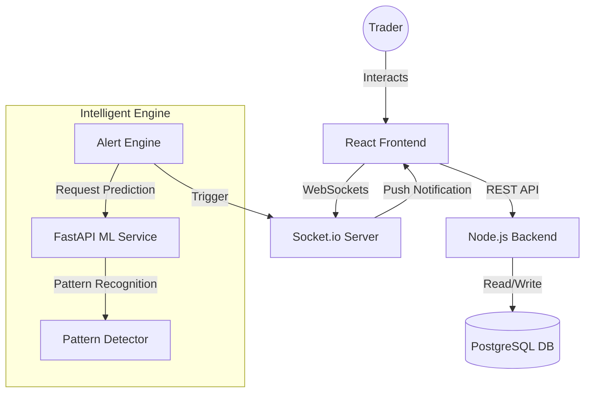

# 🚀 Stock Simulator: Real-Time Trading & ML Analysis


## 🌟 Project Overview
Stock Simulator is a high-performance, full-stack trading simulation platform that combines real-time market dynamics with Machine Learning-driven insights.


 Designed for both novice traders and data enthusiasts, the platform provides a risk-free environment to practice trading strategies, monitor market trends, and receive automated alerts based on sophisticated technical patterns.

---

## ✨ Key Features

### 📈 1. Real-Time Trading Engine
- **Instant Execution**: Buy and sell stocks with virtual currency.
- **Dynamic Pricing**: Experience market volatility with simulated price movements and spikes.
- **Portfolio Tracking**: Real-time P&L tracking, asset distribution, and transaction history.


### 🤖 2. Machine Learning Pattern Detection
- **Automated Analysis**: A dedicated Python-based ML service scans market data for technical patterns (Double Top, Head and Shoulders, etc.).
- **Signal Accuracy**: Each detection includes a confidence score, ensuring only high-probability signals are flagged.
- **Visual Insights**: View detected patterns directly on interactive candlestick charts.


### 🔔 3. Intelligent Alert System
- **Global Scanning**: Background engine scans all active stocks every 30 seconds for ML patterns.
- **User Notifications**: Receive instant, real-time alerts via WebSockets based on your watchlist or global settings.
- **Personalization**: Toggle global alerts or stick to your curated watchlist.

### 🛡️ 4. Advanced Admin Dashboard
- **Market Controls**: Admins can manually override stock prices or inject "volatility spikes" to simulate market crashes/booms.
- **Fraud Detection**: Integrated system to monitor suspicious trading behavior and unusual win rates.
- **Analytics Hub**: Visualize platform health with KPI cards, volume heatmaps, and sector distribution charts.


---

## 🛠️ Tech Stack

| Component | Technology |
| :--- | :--- |
| **Frontend** | React, TailwindCSS, Recharts, Lucide Icons |
| **Backend** | Node.js, Express, PostgreSQL, Socket.io |
| **ML Service** | Python, FastAPI, Pandas, NumPy, Pydantic |
| **Security** | JWT Authentication, Bcrypt Password Hashing |

---

## 🏗️ System Architecture



---

## 🚀 Quick Setup Guide

### 1. Database Initialization
Execute the migration to set up the schema and required tables:
```bash
psql -U postgres -d stock_simulator -f backend/database_setup.sql
```

### 2. Machine Learning Service (Python)
```bash
cd ml-service
pip install -r requirements.txt
uvicorn main:app --port 8000
```

### 3. Backend (Node.js)
```bash
cd backend
npm install
npm start
```

### 4. Frontend (React)
```bash
cd frontend
npm install
npm start
```

---

## 📊 Environment Variables
Create a `.env` file in the `backend/` directory:
```env
DB_USER=postgres
DB_HOST=127.0.0.1
DB_NAME=stock_simulator
DB_PASSWORD=your_password
JWT_SECRET=your_jwt_secret
ML_API_URL=http://localhost:8000/predict
```

---


---

*Built with ❤️ by Prudhvi Sunku*
